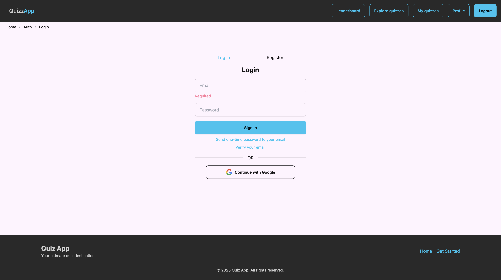
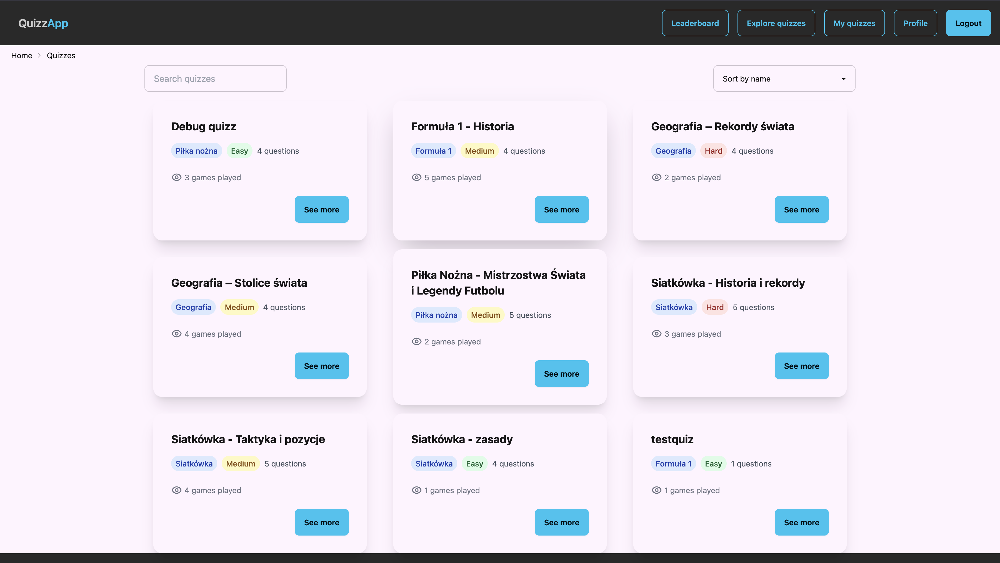
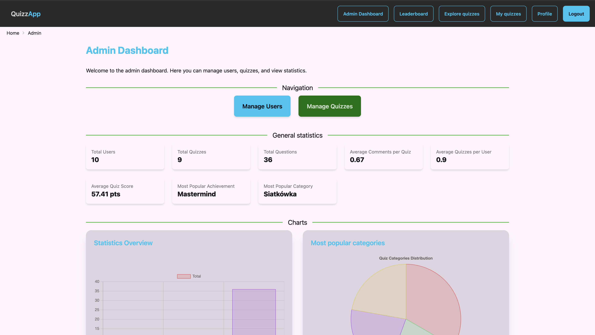
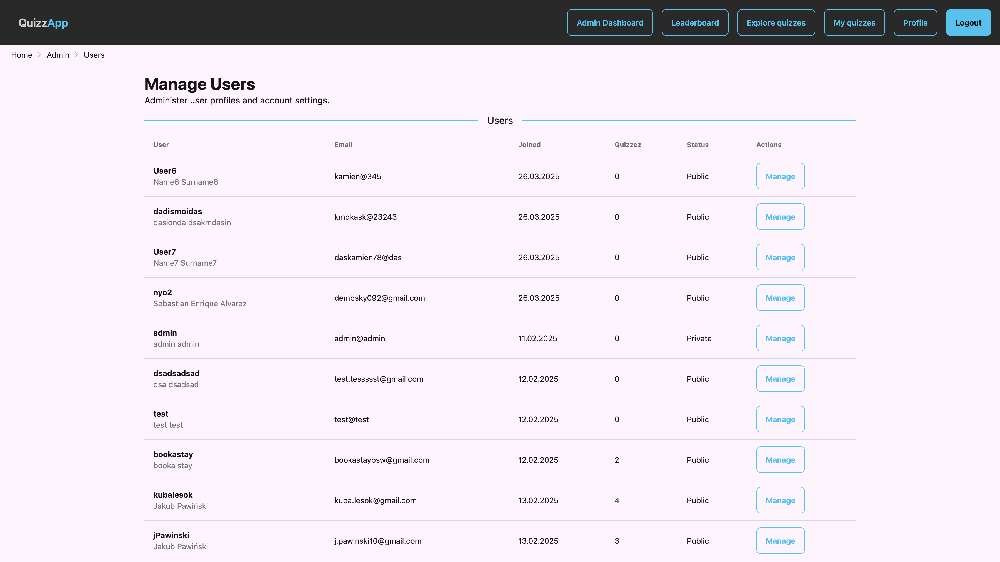
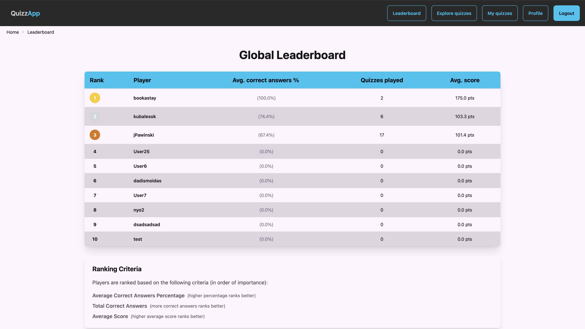
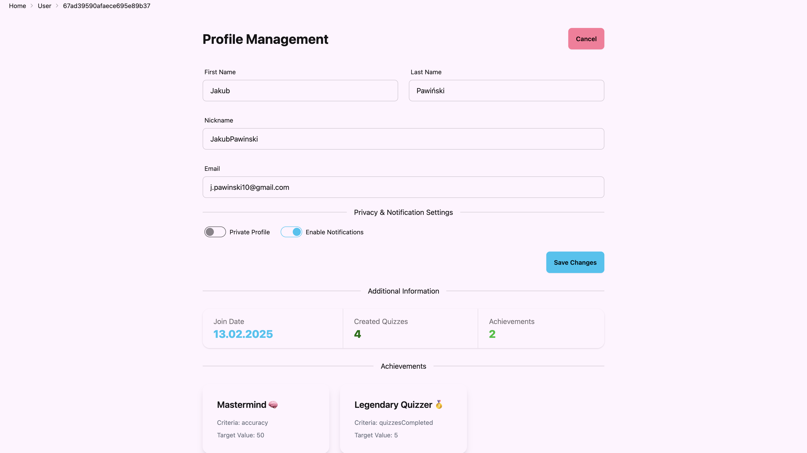
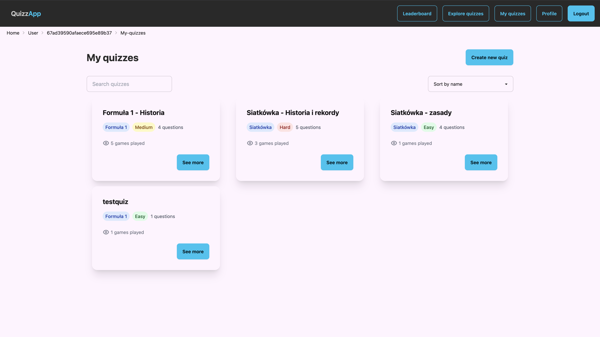
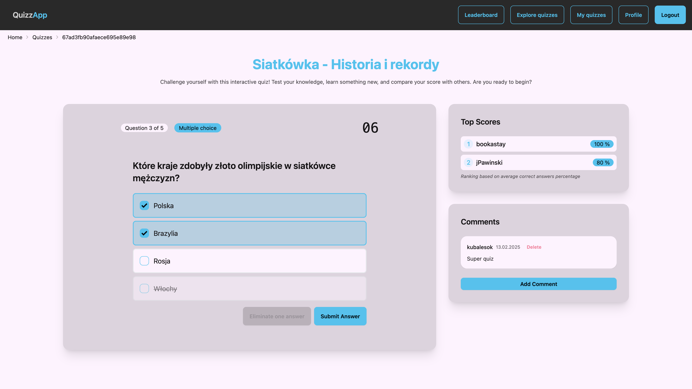
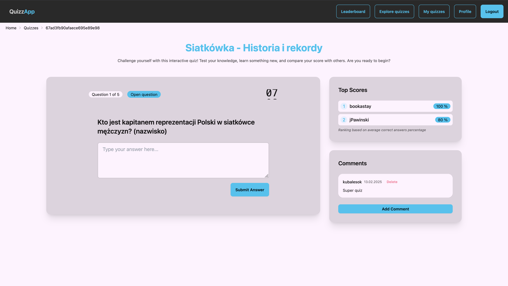

# Quiz App

📝 **Description**  
Quiz App is an interactive web application that allows users to create and solve quizzes. It enables easy question creation, topic management, and user progress tracking.

## ✨ Features

- **Quiz Creation:** Create custom question sets with various answer formats
- **Multiple Categories:** Organize quizzes by topics and difficulty levels
- **Scoring System:** Automatic score calculation and statistics presentation
- **Learning Mode:** Repeat challenging questions and track progress
- **Responsive Design:** Access quizzes on all devices

## 📸 Screenshots

### Login Page



### Main Screens



### Admin Panel




### Leaderboard



### User Profile




### Quiz Gameplay




## 🛠️ Technologies

- **Frontend:** React.js, Next.js, Tailwind
- **Backend:** Node.js, Express.js
- **Database:** MongoDB
- **Authentication:** JWT, OAuth

## 📂 Project Structure

```
QuizzApp/
├── public/              # Static files
├── src/
│   ├── app/             # Next.js app router pages
│   │   ├── admin/       # Admin dashboard pages
│   │   ├── auth/        # Authentication pages
│   │   ├── quizzes/     # Quiz creation and playing
│   │   ├── user/        # User profile pages
│   │   └── leaderboard/ # Leaderboard page
│   ├── components/      # Reusable components
│   │   ├── admin/       # Admin-specific components
│   │   ├── layout/      # Layout components (Navbar, Footer)
│   │   ├── auth/        # Authentication components
│   │   ├── quiz/        # Quiz-related components
│   │   │   ├── game/    # Quiz gameplay components
│   │   │   ├── create/  # Quiz creation components
│   │   │   └── comments/# Quiz comments components
│   │   └── user/        # User-related components
│   ├── providers/       # React context providers
│   ├── hooks/           # Custom React hooks
│   └── config.js        # App configuration
├── .eslintrc.json       # ESLint configuration
├── jsconfig.json        # JavaScript configuration
├── next.config.js       # Next.js configuration
└── tailwind.config.js   # Tailwind CSS configuration
```

## 👤 Author

Jakub Pawiński
